Written By Jonathan Paquin for WGU Course C196

# 📱 Mobile Application Development - C196

Welcome to the Student Scheduler and Progress Tracking Application, a mobile app designed for students to manage academic terms, courses, assessments, and instructor information all in one place.

---

<details>
<summary><strong>📜 Index</strong> (click to expand)</summary>

* [Overview](#overview)
* [OS Requirements](#os-requirements)
* [Build & Install Guide (Task E)](#build--install-guide-task-e)
* [Storyboard & Screenshots (Task D)](#storyboard--screenshots-task-d)

  * [Main Activity](#main-activity)
  * [Dashboard Activity](#dashboard-activity)
  * [Add Term Activity](#add-term-activity)
  * [Term Details Activity](#term-details-activity)
  * [Edit Term Activity](#edit-term-activity)
  * [Add Course Activity](#add-course-activity)
  * [Course Details Activity](#course-details-activity)
  * [Edit Course Activity](#edit-course-activity)
  * [Add Assessment Activity](#add-assessment-activity)
  * [Assessment Details Activity](#assessment-details-activity)
  * [Edit Assessment Activity](#edit-assessment-activity)

</details>

---

## 📘 Overview

This application helps students:

* Track academic **terms**, **courses**, and **assessments**
* Store **instructor contact information**
* Receive **notifications** for course start and end dates

---

## 📱 OS Requirements

* **Minimum Android Version**: Android 8.0 (API level 26 - Oreo)
* **Tested On**:

  * Emulated Pixel 9 Pro (Android 16)
  * Emulated Pixel 2 XL (Android 8.1)
  * Xiaomi Mi 12T Pro (Android 15, installed via APK)

---

## ⚙️ Build & Install Guide (Task E)

1. **Clone or Download** this repository.
2. In **Android Studio**:

   * Navigate to: `File` > `New` > `Import Project...`
   * Select the root folder of the project
3. **Build the project** and resolve any issues.

### 🔐 Signed APK Output:

You can find the final APK at:

```
app/release/app-release.apk
```

### 🔧 Build Process Screenshots:

1. 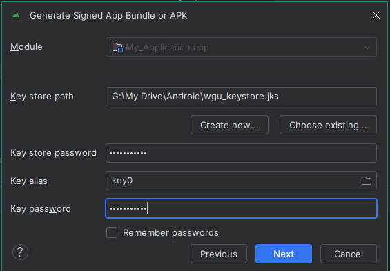
2. 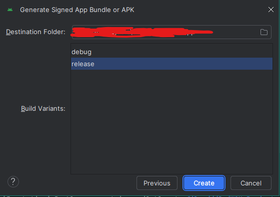
3. 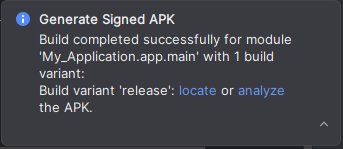
4. 

---

## 🎨 Storyboard & Screenshots (Task D)

### 🏁 Main Activity

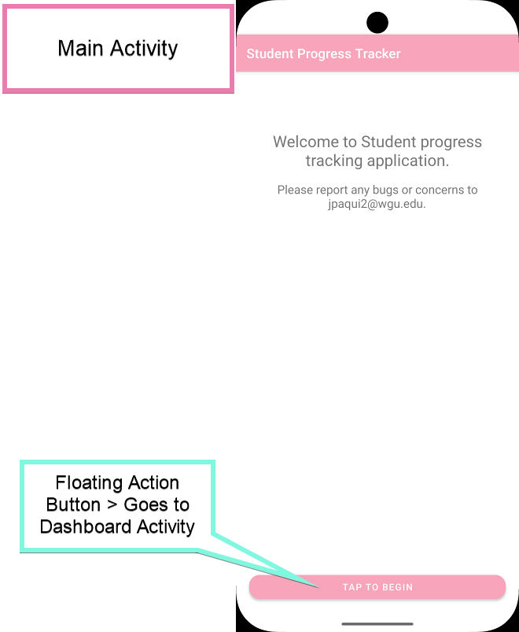
Displays the welcome screen. For now, it appears on every launch but will be shown only once in the full release.

---

### 📊 Dashboard Activity

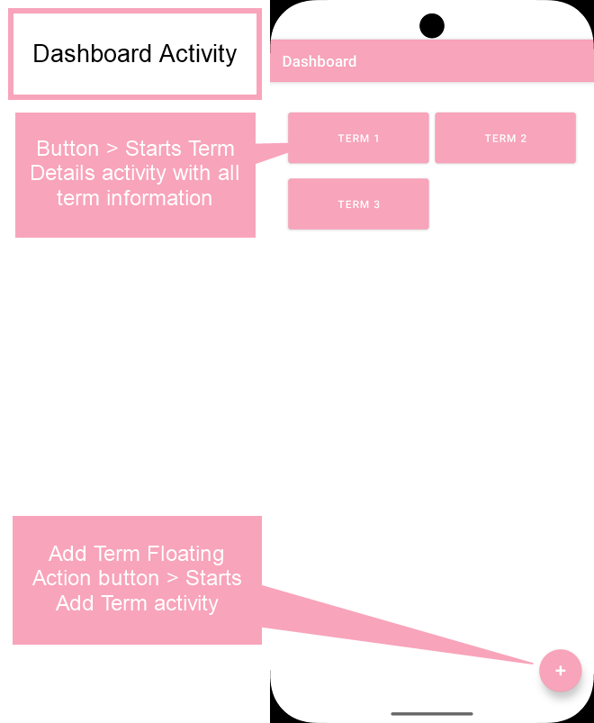

Features:

* **Term Buttons** → Navigate to individual term details
* **Add Term FAB** → Opens the Add Term screen

---

### ➕ Add Term Activity

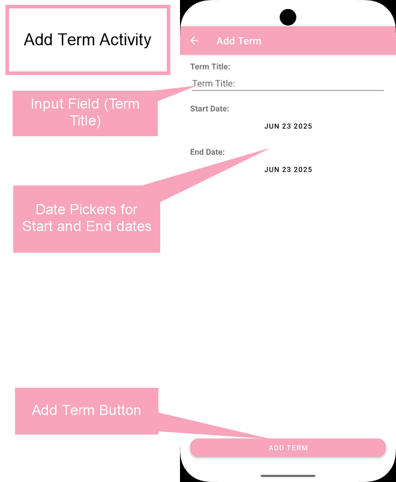

Includes:

* **Term Title Field**
* **Start Date Picker**
* **End Date Picker**
* **Add Term Button** → Saves term and navigates back to Term Details

#### 🗓️ Date Picker Example

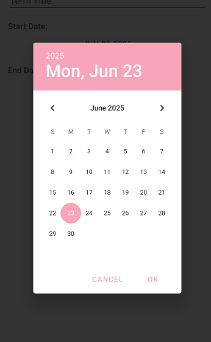

Used across the app for consistent date selection.

---

### 📂 Term Details Activity

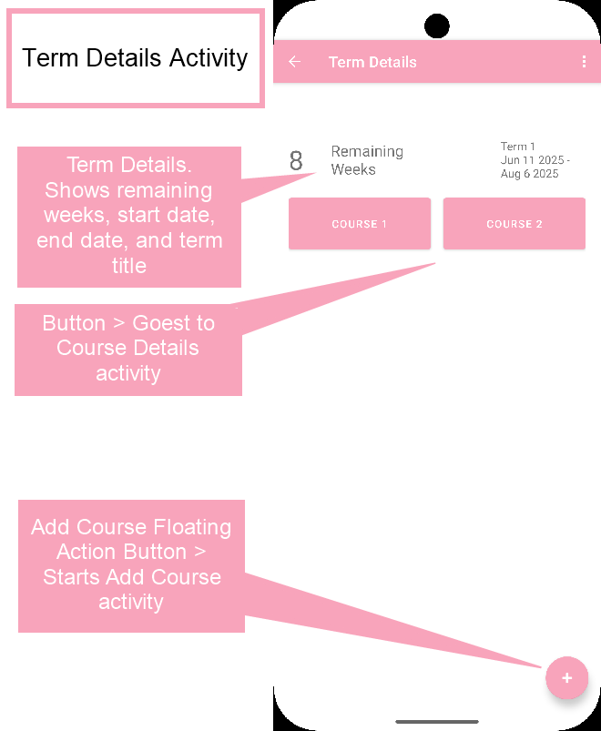

Displays:

* **Course List** for the term
* **Add Course FAB** → Opens Add Course screen
* **Action Bar Menu** → Edit/Delete term

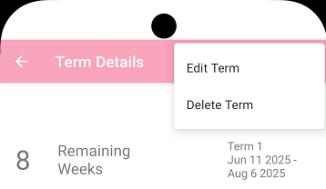

---

### ✏️ Edit Term Activity

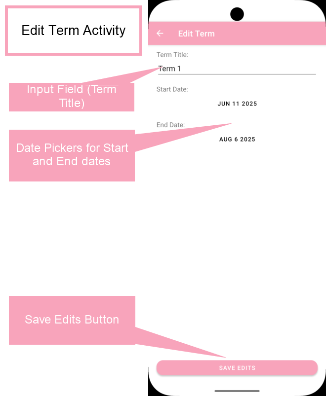

Editable fields:

* **Term Title**
* **Start/End Dates**
* **Save Edit Button** → Updates term info

---

### ➕ Add Course Activity

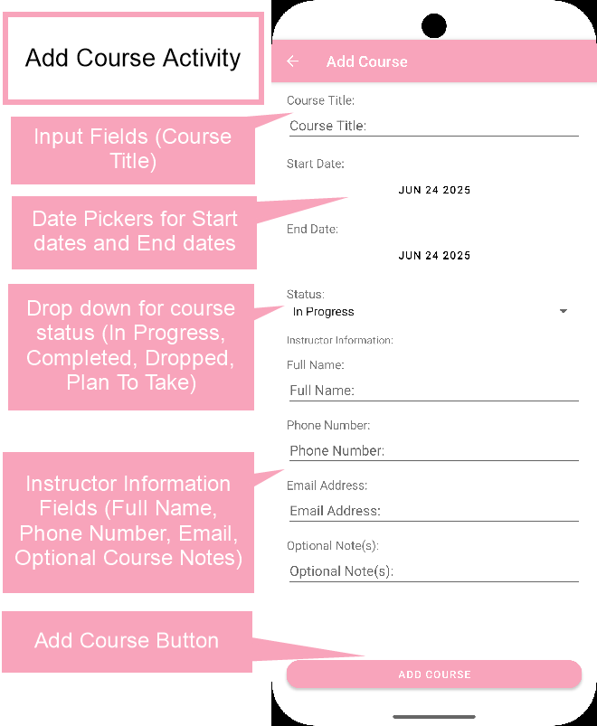

Fields:

* **Course Title**
* **Start/End Date**
* **Status Picker** (In Progress, Completed, Dropped, Plan To Take)
* **Instructor Info** (Name, Phone, Email)
* **Optional Course Notes**
* **Add Course Button**

---

### 📘 Course Details Activity

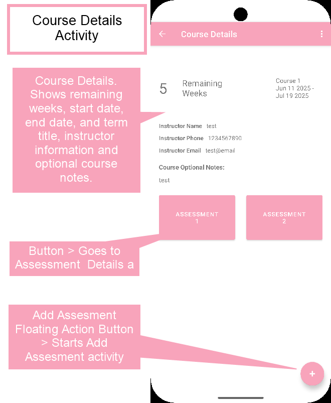

Displays:

* **Course Overview** (title, dates, instructor info, notes)
* **Assessment Buttons**
* **Add Assessment FAB**
* **Menu Options**: Set Alerts, Edit/Delete course, Share notes

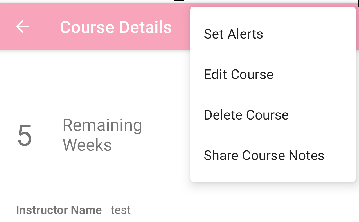

---

### ✏️ Edit Course Activity

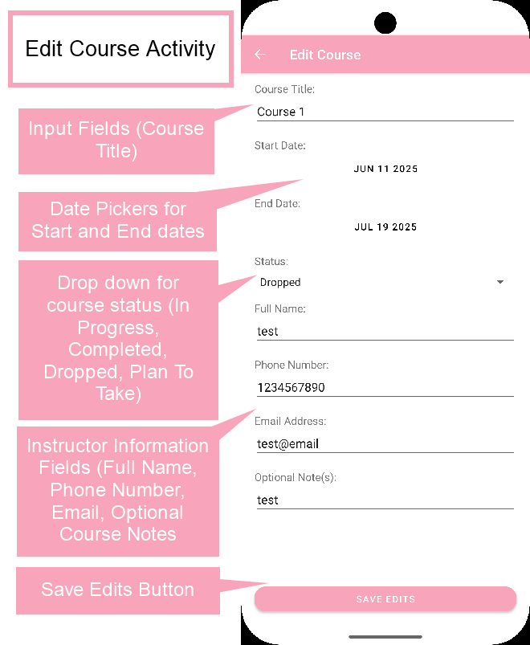

Similar to Add Course, with:

* Pre-filled data
* **Save Edits Button**

---

### ➕ Add Assessment Activity

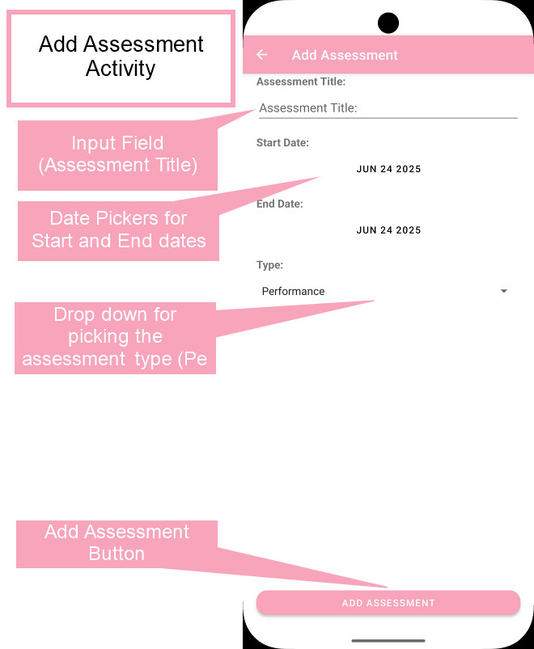

Fields:

* **Title**
* **Start/End Dates**
* **Type Dropdown** (Performance, Objective)
* **Add Assessment Button**

---

### 📋 Assessment Details Activity

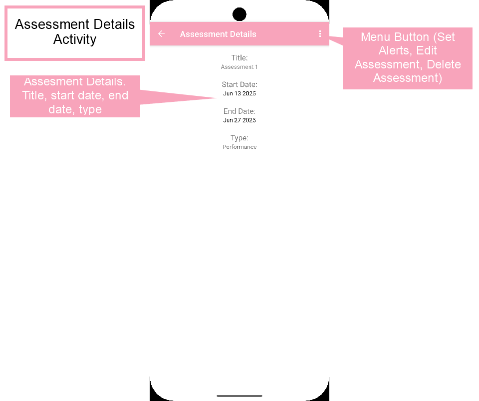

Displays:

* **Assessment Info** (title, dates, type)
* **Menu Options**: Set Alerts, Edit/Delete

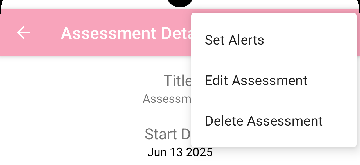

---

### ✏️ Edit Assessment Activity

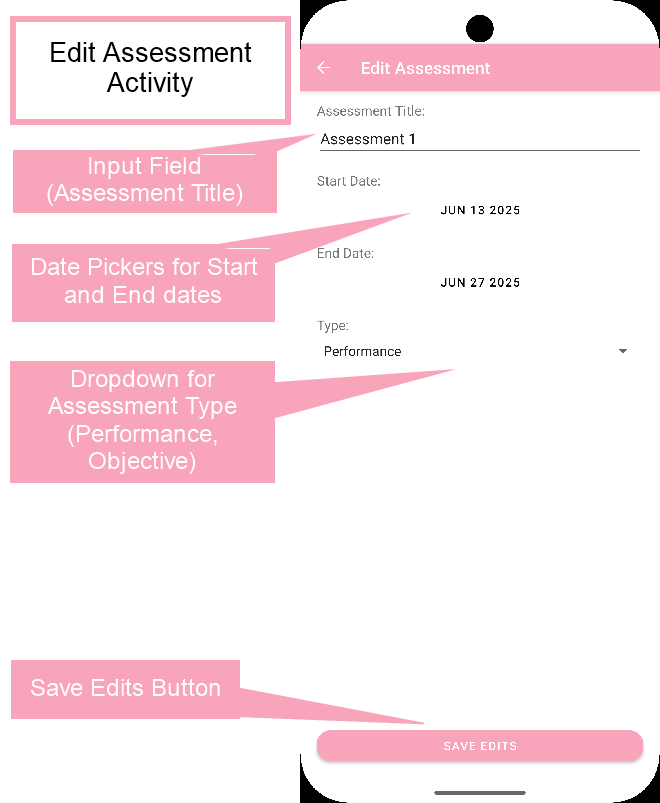

Identical structure to Add Assessment, with:

* **Editable Fields**
* **Save Edits Button**

---


## 🧠 Reflection (Task F)

### 1.

**Question:**
Explain how your application would be different if it were developed for a tablet rather than a phone, including a discussion of fragments and layouts.
**Answer:**
If the application were designed specifically for tablets, the layout and user experience would be more optimized for larger screens. I would use fragments to create a multi-pane interface, allowing users to view and interact with multiple sections; such as a list of terms and their details side by side. This would eliminate the need for navigating between separate screens and would make better use of the available screen space on tablets.

---

### 2.

**Question:**
Identify the minimum and target operating system your application was developed under and is compatible with.
**Answer:**
The application was developed with a minimum SDK version of Android 8.0 (API level 26) and a target SDK version of Android 14 (API level 34). This ensures compatibility with the majority of Android devices still in use today while still taking advantage of newer features and improvements in the latest versions.

---

### 3.

**Question:**
Describe (suggested length of 1–2 paragraphs) the challenges you faced during the development of the mobile application.
**Answer:**
One challenge was maintaining compatibility with Android 8.0. Because it’s an older version of the operating system, some newer features and APIs aren't available. I had to carefully review documentation to make sure any libraries or methods I used would run properly on devices running this version.

Another challenge was managing the project’s overall structure as it grew. Since I didn’t extract shared methods into utility classes, some logic had to be repeated in multiple parts of the app. This made certain updates more time-consuming and required extra attention to maintain consistency across the codebase.

---

### 4.

**Question:**
Describe (suggested length of 1–2 paragraphs) how you overcame each challenge discussed in part F3.
**Answer:**
To ensure compatibility with Android 8.0, I regularly tested the application on emulators and real devices running that version. I selected libraries and methods that supported older APIs and verified behavior closely to avoid issues.

For the organizational challenges, I focused on writing clean and consistent code throughout the project. Although I didn’t modularize repeated logic into utility classes, I maintained a structured approach and used consistent patterns to help keep the code readable and easier to manage.

---

### 5.

**Question:**
Discuss (suggested length of 1–2 paragraphs) what you would do differently if you did the project again.
**Answer:**
If I were to begin the project again, I would prioritize code modularity from the start. Creating shared methods or utility classes would help reduce code duplication and simplify maintenance. This approach would also make it easier to expand the application in the future.

Additionally, I would introduce more frequent testing across different Android versions earlier in development. This would help identify compatibility concerns sooner and ensure a smoother experience for users across a broader range of devices.

---

### 6.

**Question:**
Describe how emulators are used and the pros and cons of using an emulator versus using a development device.
**Answer:**
Emulators allow developers to simulate Android devices on a computer. They are useful for testing layout behavior, functionality across different screen sizes, and compatibility with various Android versions. Emulators also support features like simulating network conditions or GPS location.

**Pros:**

* No need for multiple physical devices.
* Easy to test on multiple Android versions.
* Built-in developer tools.

**Cons:**

* Slower performance compared to physical devices.
* Some hardware-specific features (like certain sensors or camera behavior) may not emulate accurately.
* May require more system resources (RAM/CPU).

For final testing and validation, using a real device provides more accurate results and better represents the actual user experience.

---

## 🧾 Task G

There are no references used in this project.
